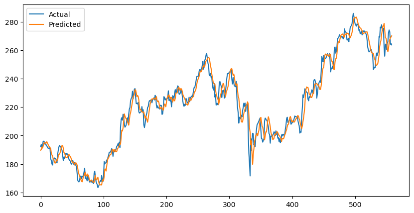

# Stock-Price-Prediction


## Description 
I have developed a model using machine learning to predict the movement of stocks using historical market data. I have used various classification and regression models to analyze the patterns and trends of the financial data. This project has helped me improve my skills in statistical analysis.

## Overview
This project aims to predict stock prices using machine learning techniques. It utilizes historical stock data to train models and make future price predictions.

## Technologies Used
- Python
- Machine Learning
- Statistical Analysis
- Yahoo Finance
- Pandas
- NumPy
- Matplotlib
- RandomForestRegression
- RandomForestClassifier
- LogisticRegression
- LinearRegression

## Steps to Run the Project
1. Clone the repository:
   ```bash
   git clone https://github.com/kapilgunde.stats/Stock-Price-Prediction.git
2. Project Directory:
           cd Stock-Price-Prediction

3. Install required libraries:
           pip install -r requirements.txt

4. Run the project:
           python stock_prediction.py  

       


## Stock-Price-Prediction
                │
                ├── stock_prediction.py
                ├── dataset.csv
                ├── project_report.pdf
                └── README.md

                
## Features

--> Data preprocessing and cleaning
--> Machine learning model training & testing
--> Use of Regression & Classification methods
--> Stock price prediction
--> Performance evaluation of models  


## Learning OutCome

* Learning Outcomes
* Through this project, I gained practical experience in:
* Data preprocessing and analysis
* Machine learning model implementation
* Financial data prediction
* Statistical modeling and evaluation

## Project Result



## Author
Kapil Gunde
M.Sc Statistics – Banaras Hindu University 
2026-27
